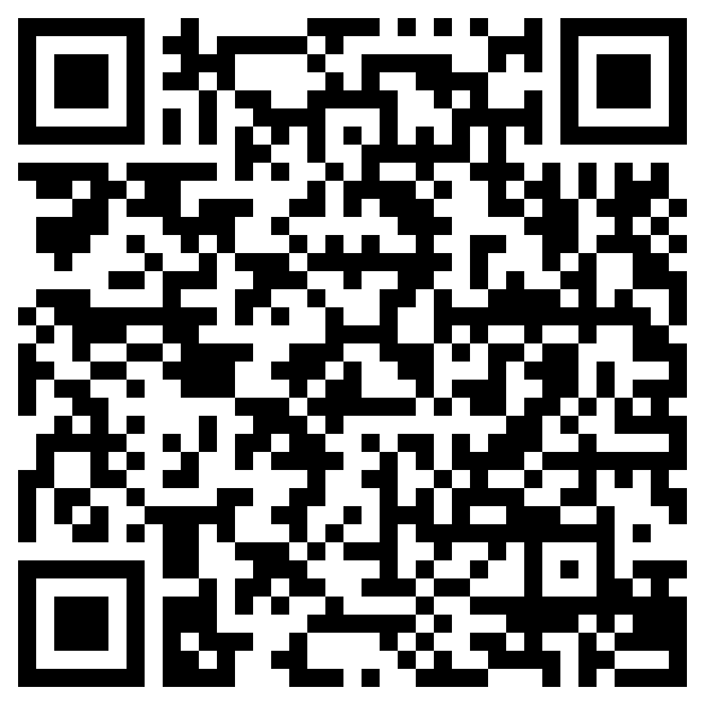

# Shadowrocket Configuration

## Install

1. Download app from [App Store](https://itunes.apple.com/ru/app/shadowrocket/id932747118?mt=8)
2. Open `Shadowrocket` app, on the Homepage click `Scan QR` button on the left of the Logo in topbar
3. Scan the QR below
4. Import Config and turn on the switch

## Qrcode

Scan this qrcode to import into [Shadowrocket](https://itunes.apple.com/ru/app/shadowrocket/id932747118?mt=8) app.

